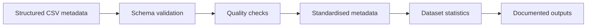
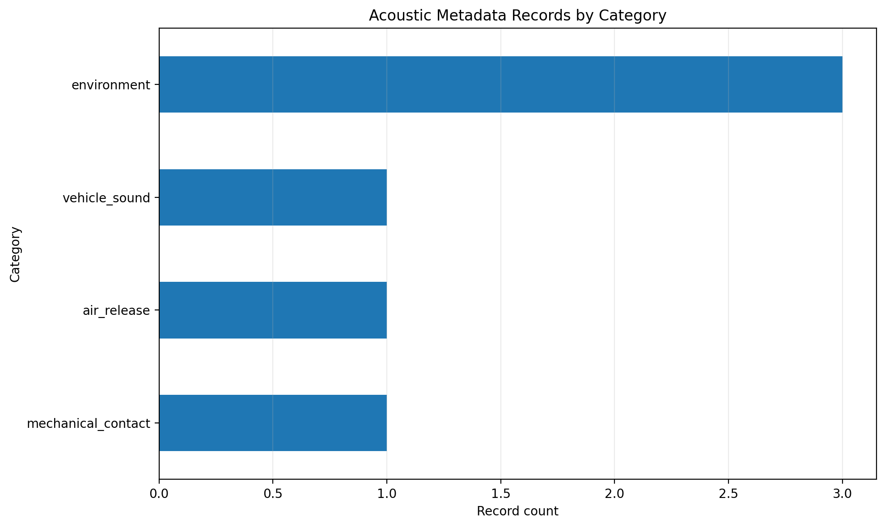
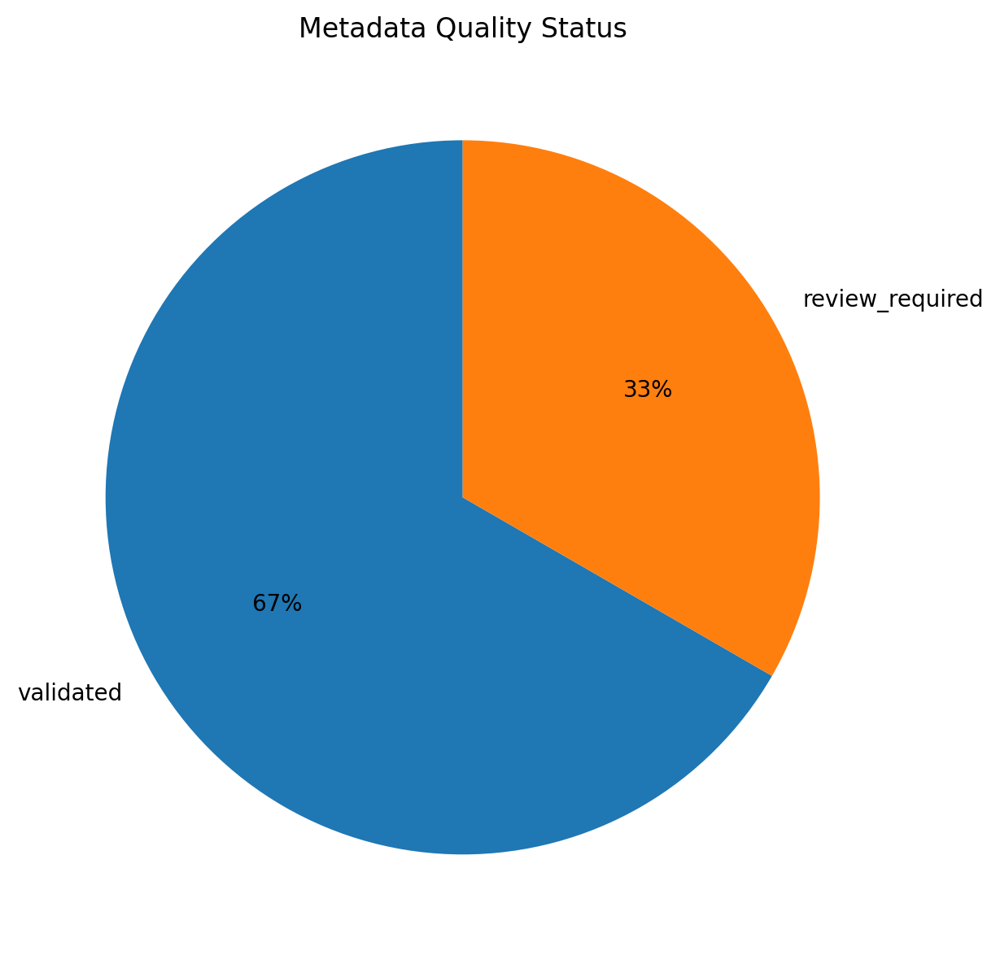

# Acoustic Dataset Explorer

[](https://www.python.org/)
[](#testing)
[](LICENSE)
[](#project-status)

[](https://github.com/rukiye-erdogan/acoustic-dataset-explorer/actions/workflows/ci.yml)

A reproducible Python data-engineering project for validating, standardising and analysing acoustic metadata.

## Why this project

Public acoustic datasets often use different schemas, naming conventions, licence fields and quality labels. This project provides a compact, source-agnostic workflow that turns heterogeneous metadata into a consistent and testable structure.

The repository focuses on metadata engineering rather than audio distribution. It contains synthetic example metadata only and does not publish third-party audio files.

## Core capabilities

- Validate required metadata fields
- Detect duplicate identifiers
- Check numeric fields for invalid or non-positive values
- Summarise sources, event types and categories
- Calculate total dataset duration
- Provide a documented metadata schema
- Run automated tests with `pytest`
- Support reproducible local execution

## Data pipeline



## Repository structure

```text
acoustic-dataset-explorer/
├── data/
│   └── sample/
│       └── sample_metadata.csv
├── docs/
│   ├── data_dictionary.md
│   └── methodology.md
├── src/
│   ├── __init__.py
│   ├── dataset_statistics.py
│   └── validate_metadata.py
├── tests/
│   ├── __init__.py
│   └── test_validate_metadata.py
├── .gitignore
├── LICENSE
├── README.md
└── requirements.txt
```

## Metadata schema

The example dataset uses the following fields:

| Field | Purpose |
|---|---|
| `file_id` | Unique record identifier |
| `source` | Origin of the metadata record |
| `event_type` | Specific acoustic event |
| `category` | Higher-level acoustic grouping |
| `duration_seconds` | Duration of the audio record |
| `sample_rate` | Sampling frequency in hertz |
| `channels` | Number of audio channels |
| `license` | Licence information |
| `quality_status` | Validation or review state |

See [docs/data_dictionary.md](docs/data_dictionary.md) for the full description.

## Quick start

### 1. Clone the repository

```bash
git clone https://github.com/rukiye-erdogan/acoustic-dataset-explorer.git
cd acoustic-dataset-explorer
```

### 2. Install dependencies

```bash
python -m pip install -r requirements.txt
```

### 3. Validate metadata

```bash
python -m src.validate_metadata data/sample/sample_metadata.csv
```

Expected output:

```text
Validation successful.
```

### 4. Generate dataset statistics

```bash
python -m src.dataset_statistics data/sample/sample_metadata.csv
```

Example output:

```text
Acoustic Dataset Summary
==========================
Records: 6
Sources: 1
Event types: 6
Categories: 4
Total duration: 49.70 seconds
```

## Data-quality checks

The validator currently checks:

- required columns
- empty datasets
- duplicate `file_id` values
- invalid numeric values
- zero or negative duration, sample-rate and channel values

## Testing

Run the automated test suite with:

```bash
python -m pytest -q
```

Current result:

```text
1 passed
```

## Engineering focus

This repository demonstrates practical experience with:

- Python
- pandas
- metadata modelling
- data-quality validation
- reproducible data pipelines
- automated testing
- technical documentation
- Git and GitHub
- open-source project structure

## Project status

**Active development**

Current scope:

- metadata schema
- validation workflow
- statistical summaries
- sample data
- automated tests
- technical documentation

## Roadmap

- Add configurable validation rules
- Add source-specific metadata adapters
- Add visual reporting
- Add exportable quality reports
- Add GitHub Actions for continuous integration
- Extend the synthetic sample dataset

## Data and licence notice

The repository contains synthetic metadata created for demonstration purposes. No third-party audio files are included.

The source code is licensed under the [MIT License](LICENSE).


## Visualisations

The repository includes generated visual summaries based on the synthetic metadata sample.

### Category distribution



### Metadata quality status



Generate the visualisations locally with:

```bash
python -m src.generate_visualizations
```
