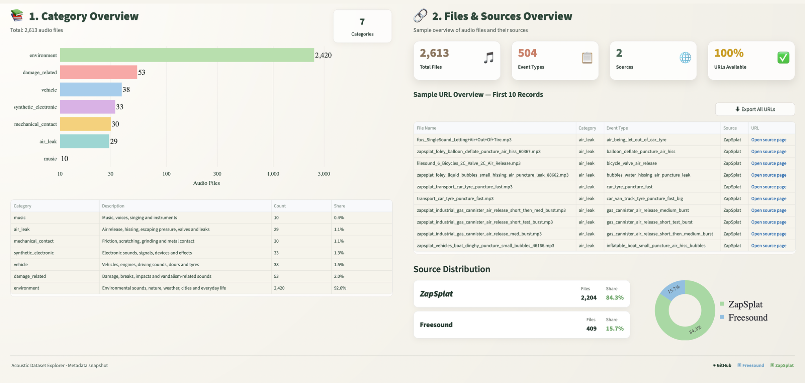
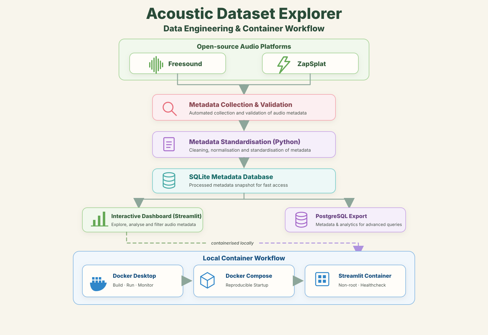
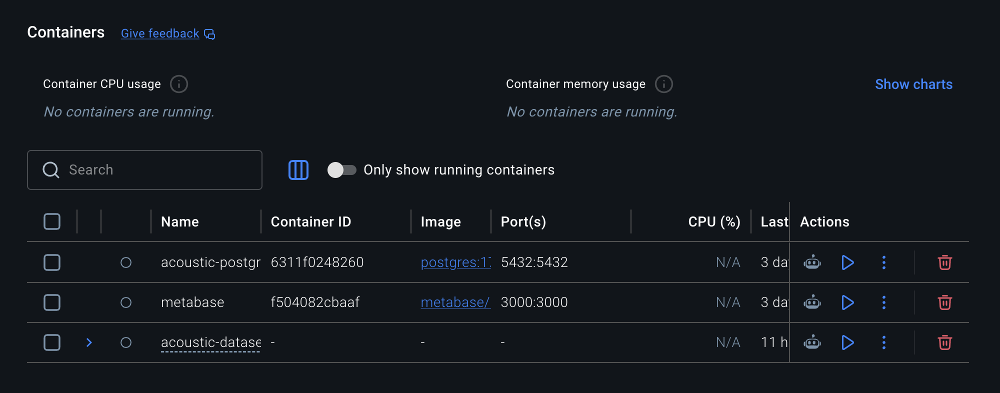

# 🎧 Acoustic Dataset Explorer

<p align="left">
  <a href="https://acoustic-dataset-explorer.streamlit.app">
    
  </a>
  <a href="https://github.com/rukiye-erdogan/acoustic-dataset-explorer">
    
  </a>
  <a href="https://github.com/rukiye-erdogan/acoustic-dataset-explorer/blob/main/LICENSE">
    
  </a>
  <a href="https://github.com/rukiye-erdogan/acoustic-dataset-explorer/commits/main">
    
  </a>
  <a href="https://github.com/rukiye-erdogan/acoustic-dataset-explorer">
    
  </a>
</p>

An open-source data engineering project for collecting, validating, standardising and exploring acoustic metadata.



---

## 🚀 Live Application

### 📊 Interactive Streamlit Dashboard

Explore the acoustic metadata dataset through interactive Plotly charts, category analytics, source statistics and exportable metadata tables.

<p align="left">
  <a href="https://acoustic-dataset-explorer.streamlit.app">
    
  </a>
</p>

**Live URL:** [https://acoustic-dataset-explorer.streamlit.app](https://acoustic-dataset-explorer.streamlit.app)

> The public dashboard currently analyses **2,613 audio files**, **504 event types**, **7 categories** and metadata from **Freesound** and **ZapSplat**.


---


---

## 🏗️ Data Engineering Workflow

The following architecture illustrates the complete metadata engineering workflow used in this project—from collecting metadata from multiple open-source audio platforms to data standardisation, local storage, PostgreSQL export and containerised deployment.

<p align="center">
  
</p>

---

## 🐳 Docker Desktop Environment

The project is fully containerised for reproducible local development. Docker Desktop manages the complete environment, while Docker Compose orchestrates the Streamlit application and supporting services.

<p align="center">
  
</p>


## ✨ Project Overview

The Acoustic Dataset Explorer provides a reproducible workflow for analysing metadata from public acoustic datasets.

The project demonstrates practical data engineering skills by combining:

- Python
- PostgreSQL
- Streamlit
- Metabase
- Docker
- Git
- GitHub

The current dashboard analyses more than **2,600 audio files** collected from multiple open-source platforms.

---

## 📊 Dashboard Features

### Category Overview

- Category distribution
- Audio file statistics
- Category summary table
- Percentage distribution

### Files & Sources Overview

- Total audio files
- Event types
- Dataset sources
- URL availability
- Source distribution
- Interactive Plotly charts
- Exportable metadata tables

---

## 🛠 Technology Stack

| Area | Technology |
|------|------------|
| Language | Python |
| Dashboard | Streamlit |
| BI | Metabase |
| Database | PostgreSQL |
| Charts | Plotly |
| Data Processing | Pandas |
| Containerisation | Docker |
| Version Control | Git + GitHub |

---

## 📁 Repository Structure

```text
acoustic-dataset-explorer/
├── .github/
│   └── workflows/
│       └── ci.yml
├── .streamlit/
│   └── config.toml
├── assets/
│   └── dashboard/
│       └── dashboard_overview.png
├── data/
│   └── public/
│       ├── acoustic_metadata.db
│       └── acoustic_metadata_public.csv
├── .dockerignore
├── .gitignore
├── Dockerfile
├── docker-compose.yml
├── app.py
├── scripts/
│   └── import_to_postgres.py
├── requirements.txt
├── README.md
└── LICENSE
```

---

## 🎯 Current Dataset

| Metric | Value |
|---------|------:|
| Audio Files | 2,613 |
| Categories | 7 |
| Event Types | 504 |
| Sources | 2 |
| URL Availability | 100% |

---

## 🚧 Roadmap

- ✅ Metadata validation
- ✅ Interactive Streamlit dashboard
- ✅ Source statistics
- ✅ Category analytics
- ✅ Streamlit Cloud deployment
- ⏳ Metabase deployment
- ✅ Docker Compose environment
- ⏳ Automated data refresh

---

## 📄 Licence

This project is released under the MIT License.

---

## 🐳 Docker Deployment

Run the complete Acoustic Dataset Explorer locally using Docker.

### Prerequisites

- Docker Desktop
- Docker Compose

### Clone the repository

```bash
git clone https://github.com/rukiye-erdogan/acoustic-dataset-explorer.git
cd acoustic-dataset-explorer
```

### Build the image

```bash
docker compose build
```

### Start the application

```bash
docker compose up
```

Open the dashboard at:

```text
http://localhost:8501
```

### Run in the background

```bash
docker compose up -d
```

### Stop the application

```bash
docker compose down
```

### Rebuild after changes

```bash
docker compose up --build
```

### Docker components

| File | Purpose |
|---|---|
| `Dockerfile` | Builds the reproducible Streamlit image |
| `docker-compose.yml` | Starts the application on port 8501 |
| `.dockerignore` | Excludes unnecessary files from the build context |

The container runs as a non-root user and includes a health check for the Streamlit service.

---

## Final Note

This repository demonstrates practical data engineering workflows for collecting, validating, standardising and exploring real-world acoustic metadata. It showcases Python, PostgreSQL, Docker, Streamlit and modern open-source development practices.
